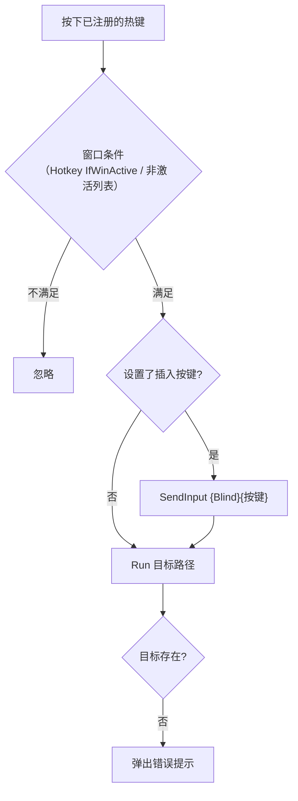
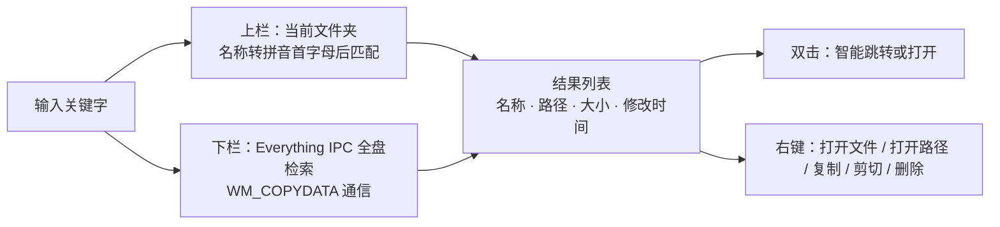
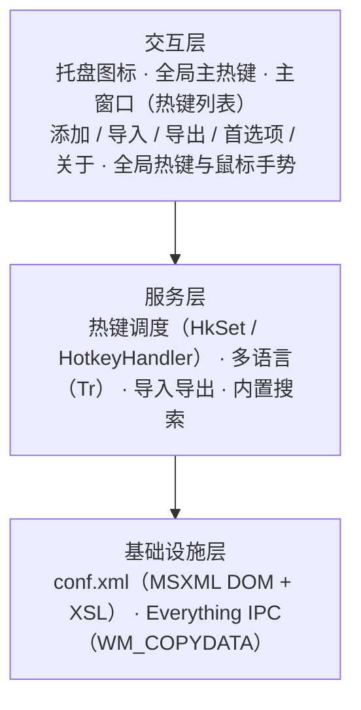

<div align="center">


# AutoHotkey ToolKit

**面向 Windows 的 AutoHotkey 热键工作台**

可视化热键管理 · 插入键（RunNoToggle）· 中 / 英双语界面 · 高 DPI 自适应 · 拼音即时文件检索 · 鼠标手势增强

<p>
  
  
  
  
</p>

[功能总览](#功能总览) ·
[快速开始](#快速开始) ·
[功能详解](#功能详解) ·
[快捷键速查](#快捷键速查) ·
[配置参考](#配置参考) ·
[架构设计](#架构设计) ·
[按键稳定性](#按键稳定性ctrlc-偶发变成-c) ·
[常见问题](#常见问题)

</div>

---

## 项目简介

**AHK-ToolKit** 是一个常驻系统托盘的 AutoHotkey 热键管理工具。它把「改脚本 → 保存 → 重载」的循环，换成**所见即所得的图形界面**：新增、修改、删除热键即时生效，全部数据保存在**同一份配置文件**中。

项目由 **RaptorX** 于 2010 年创建并以 GPLv3 开源；本仓库在上游 0.8.x 的基础上演进至 **0.9.0-161030**，并在本轮优化中做了**精简与加固**：移除代码检测、命令助手、Live Code、屏幕工具与热字符串五个模块（连同 Scintilla 等随附组件），集中打磨热键管理本身——新增中 / 英文界面切换、原生高 DPI 适配、「插入按键」高级选项，并对「Ctrl+C 偶发变成字母 c」这类吞键问题做了排查与加固。

### 设计理念

| 理念 | 说明 |
| :-- | :-- |
| **零重启** | 热键通过 `Hotkey` 命令即时注册；新增、修改、删除均无需重启主程序。 |
| **配置即数据** | 全部设置与热键集中保存于单个 `conf.xml`（UTF-8，缩进格式化），便于备份、迁移与版本管理。 |
| **可进可退** | 支持从现有 `.ahk` 脚本批量导入热键，也可随时导出为标准 `.ahk` 文件，不被工具「锁定」。 |
| **稳定优先** | 避免向系统注入多余的 Ctrl 事件、缩短钩子超时窗口、热键回调不再反查配置，降低「按键丢失 / 修饰键错乱」的风险。 |
| **开放可改** | 单文件主程序 + 精简的 `lib/`，核心逻辑均有中文注释，GPLv3 授权，欢迎二次开发。 |

---

## 功能总览

| 模块 | 能力概述 | 入口 |
| :-- | :-- | :-- |
| **热键管理器** | 以列表管理「文件 / 文件夹」热键；支持窗口条件、左右修饰键、通配符、透传、钩子、松开触发；即时生效 | 主窗口 |
| **插入按键** | 触发后**先补发一个按键再启动目标**，等价于 `RunNoToggle`：趁 Shift 仍按住时补发 `vk07`，阻止输入法把这次 Shift 当作单击而切换中 / 英文 | 添加热键 · 高级选项 |
| **双语界面** | English / 中文 一键切换，覆盖菜单、对话框、列表、提示与状态栏；切换后自动重载生效 | 首选项 · Language |
| **高 DPI 自适应** | 使用 AutoHotkey 原生 DPI 缩放：所有窗口按 96 DPI 基准布局，在 125% / 150% / 200% 缩放下清晰、比例一致 | 全部窗口 |
| **导入 / 导出** | 递归扫描文件夹或选择多个 `.ahk`，解析单行 `热键::Run, 路径` 导入；导出为标准脚本（窗口条件转为 `#If`） | File 菜单 |
| **内置搜索** | 当前目录拼音首字母匹配 + Everything 全盘检索；智能跳转到资源管理器 / Total Commander 等 | `Alt + CapsLock` |
| **鼠标手势层** | 侧键、滚轮、右键组合：调音量与亮度、最小化 / 最大化 / 关闭窗口、窗口拖拽缩放、跨屏移动（个人工作流） | 鼠标 |
| **系统集成** | 托盘常驻、开机自启、单实例、挂起 / 重载热键、按键历史、配置损坏恢复 | 托盘 / 命令行 |

---

## 快速开始

### 环境要求

| 项目 | 要求 |
| :-- | :-- |
| 操作系统 | Windows（内置搜索模块要求 **64 位** 系统；推荐 Windows 10 / 11） |
| 运行方式 | **AutoHotkey_L v1.1.30+（Unicode、32 位）源码运行**，或自行编译为 32 位 EXE（内置搜索加载 `Everything32.dll`，需 32 位进程） |
| 不兼容 | AutoHotkey v2.0（项目使用 v1 语法）、ANSI 版 |
| Everything | 当前版本在启动时会拉起 Everything，需自备并配置路径（见下文警告） |

> [!WARNING]
> **启动前必读：Everything 路径。** 主程序在启动阶段（`AHK-ToolKit.ahk` 的 `[Basic Script Info]` 区段，约 L95–97）会无条件执行 `Gosub, EverythingStart`，先结束已运行的 `Everything64.exe` / `Everything.exe` / `LoveStudy.exe`，再从 `EveryThingPath` 启动 `LoveStudy.exe -startup`。
> 如果该路径无效，程序会提示「Everything运行出错」并**直接退出**。请先按 [需要按需修改的位置](#需要按需修改的位置) 调整路径；若不需要内置搜索，参见 [常见问题](#常见问题) 中的精简办法。

> [!IMPORTANT]
> 仓库中的 `AHK-ToolKit.exe` 是**优化前**编译的旧版本，不包含本轮改动。请使用源码运行，或用 Ahk2Exe 重新编译 `AHK-ToolKit.ahk`。

### 获取与运行

```bash
git clone https://github.com/YinsitanAI/AHK-ToolKit.git
cd AHK-ToolKit
```

**方式 A：源码运行**

```bat
:: 使用 32 位 AutoHotkey_L 1.1.30+ Unicode 版执行
AutoHotkeyU32.exe AHK-ToolKit.ahk
```

**方式 B：自行编译**

使用 Ahk2Exe 编译 `AHK-ToolKit.ahk`。源码末尾内置了 `Compile_AHK SETTINGS` 区块，已预置版本信息与图标（`res/AHK-TK.ico`）。编译后的 EXE 需与 `lib/`、`res/`、`conf.xml` 位于同一目录。

> [!TIP]
> 仓库自带的 `conf.xml` 是作者本人的使用数据（含大量指向 `D:\` 的热键）。如果想从**干净状态**开始，请先将其重命名或删除，程序将自动进入下方的首次运行向导并生成默认配置。

### 首次运行向导

当 `conf.xml` 不存在时，程序弹出 **First Run / 首次运行** 窗口，一次性完成基础设置：

| 分组 | 选项 |
| :-- | :-- |
| Startup / 启动 | 随 Windows 启动 · 启动后最小化 · 启动时检查更新 |
| Language / 语言 | English · 中文（默认跟随系统界面语言） |
| Main GUI Hotkey / 主窗口热键 | 唤出主窗口的全局热键，默认 `` Win + ` ``（Win + 反引号）；窗口激活时直接按键即可选中该键 |

所有选项之后均可在 **Settings → Preferences**（`Ctrl + P`）中修改；切换语言后程序会自动重载。

### 日常使用路径

1. 按 `` Win + ` `` 呼出主窗口（再按一次隐藏；点击托盘图标同样可以切换）。
2. 点击 **Add**，选择类型、录入按键，保存后**立即生效**。
3. 需要「先补发按键再启动」（如替代 `+b::RunNoToggle(...)`）时，在**高级选项**中勾选 **Insert key before launch** 并填入 `vk07`。
4. 底部 **Quick Search** 输入即过滤；**双击**条目编辑，**Delete** 删除。

---

## 功能详解

### 热键管理器

主窗口以表格集中管理所有热键，列为 **类型 / 名称 / 热键 / 路径**，热键以 `Win + W`、`Ctrl + Alt + S` 的易读格式展示（内部以 AHK 短格式 `#w`、`^!s` 存储，由 `hkSwap` 双向转换）。

**两种热键类型**

| 类型 | 行为 |
| :-- | :-- |
| **File** | 启动 `.exe` / `.ahk` / 图片 / 文档等文件；触发时若文件不存在，给出提示而不是静默失败 |
| **Folder** | 在资源管理器中打开指定文件夹 |

> 原先的 **Script**（内嵌脚本）类型已移除：这类热键依赖已删除的 Scintilla 编辑器与解释器回退机制。需要运行脚本时，请把脚本保存为 `.ahk` 文件，再用 **File** 类型指向它。

**高级选项（Add Hotkey 对话框）**

| 选项 | 对应前缀 | 作用 |
| :-- | :--: | :-- |
| 窗口条件：仅在这些窗口激活时生效 / 不在这些窗口激活时生效 | — | 逗号分隔，支持正则，**区分大小写**（正则前缀 `i)` 可忽略大小写）；运行期即时过滤，导出时转为 `#If` |
| Left modifier only / Right modifier only | `<` / `>` | 仅响应左 / 右侧修饰键 |
| Wildcard | `*` | 即使同时按下其他修饰键也触发 |
| Pass-through | `~` | 触发的同时保留按键原有功能 |
| Install hook | `$` | 强制使用键盘钩子 |
| Fire on release | ` UP` | 松开按键时才触发 |
| **Insert key before launch** | — | 触发后先以 `{Blind}{按键}` 补发所填按键（默认 `vk07`），再启动目标 |

**插入按键 = `RunNoToggle`**

```ahk
; 原来需要手写：
+b::RunNoToggle("D:\音速启动软件\TC操作\博士学习.ahk")
RunNoToggle(path){
    SendInput {Blind}{vk07}     ; 必须最先执行：趁 Shift 还按着补发空键
    Run, %path%
}
```

在界面中新建热键 `Shift + B`、类型 File、路径指向该脚本，并勾选 **Insert key before launch**（填 `vk07`），即得到等价行为，无需再手写函数。`{Blind}` 保证补发按键时不改变修饰键的当前状态；`vk07` 是系统未分配的虚拟键，对应用无副作用。

**热键触发流程**



- 热键回调通过 `Func.Bind` 在注册时就绑定好「路径 / 插入键 / 排除列表」，触发时不再读取 XML，既更快（插入键能在修饰键仍被按住时立即发出），也修复了旧实现里勾选「透传 `~`」后热键找不到配置节点而不执行的问题。
- 「仅在这些窗口激活时生效」每个标题注册一份上下文；「不在这些窗口激活时生效」通过窗口组实现；两者同时设置时，后者在触发时检查。

**日常操作**

- **双击**条目进入编辑；**双击空白处**新建；**Delete** 键删除，支持多选。
- 底部 **Quick Search** 同时检索名称与路径，输入即过滤。
- 状态栏实时显示当前生效的热键数量与程序版本；窗口可自由缩放，控件按 DPI 基准自适应。
- 修改按键、条件、插入键后保存，旧热键自动注销、新热键立即注册。

### 界面语言与 DPI

- **语言**：首选项 → **Language** 选择 English 或 中文。词条表集中在 `LoadZh()`，主程序以英文原文为键、`Tr()` 负责翻译（含 `{1}` `{2}` 占位符）；语言保存在 `conf.xml` 的 `Startup@lang`，切换后自动 `Reload`。新增语言只需补充一份词条表。
- **DPI**：窗口按 96 DPI 基准写坐标，由 AutoHotkey 原生缩放（`+DPIScale`，默认开启）。`GuiControl Move`、`A_GuiWidth/Height`、`SB_SetParts`、`LV_ModifyCol` 等均在同一套逻辑坐标下工作，无需手工乘以缩放系数。

### 导入与导出

**导入（File → Import/Export → Import Hotkeys）**

- 来源可选**文件夹**（可勾选递归子文件夹）或**多个文件**。
- 基于正则解析**单行**的 `热键::Run, 路径` 形式（支持 `$ ~ * < >` 前缀与 `UP` 后缀、带引号路径、行尾注释）；解析结果先在预览列表中呈现，**双击**条目会用记事本打开来源文件，确认后点 **Accept** 才会写入配置；已存在的按键自动跳过并在提示中统计。

**导出**

- 将全部热键导出为标准 `.ahk` 文件（头部自带 `SetTitleMatchMode, RegEx`），目标文件已存在时可选择**追加**。
- 设置了插入键的热键导出为 `SendInput, {Blind}{键}` + `Run`；设置了窗口条件的热键用 `#If WinActive(...)` 包裹。

### 内置搜索

基于 Everything 与拼音首字母的即时文件检索。按 **`Alt + CapsLock`** 呼出无边框搜索窗口，边输入边出结果。



| 特性 | 说明 |
| :-- | :-- |
| **上下双栏** | 上栏检索「触发搜索时所在窗口」的当前目录，下栏展示 Everything 全盘结果（最多 200 条，自动去重） |
| **拼音首字母** | 上栏检索时，`zh2py` 依据 GB2312 一、二级汉字区位码把文件名转为拼音首字母串再匹配，例如输入 `wd` 即可命中「文档」；模块另附 Unicode→拼音码表用于生僻字与多音字补全（当前加载语句处于注释状态，可按需启用） |
| **当前路径感知** | 自动识别资源管理器、Total Commander、7-Zip、FileZilla、FreeCommander、通用文件对话框、控制台、桌面等窗口的当前路径 |
| **智能跳转** | 双击结果时，若来源窗口是受支持的文件管理器或文件对话框，则直接**在原窗口内跳转**到目标路径；否则以默认方式打开 |
| **右键菜单** | 打开文件 · 打开路径 · 复制 · 剪切 · 删除（进回收站）；复制 / 剪切使用真实的 `CF_HDROP` 文件剪贴板，可直接在资源管理器中粘贴 |
| **视图切换** | **切换** 按钮在详细信息视图与图标视图间切换 |
| **索引重建** | **重建** 按钮让 Everything 重新建立索引，状态栏显示耗时 |
| **便捷细节** | 单击状态栏复制所选条目路径；窗口失去焦点自动关闭；多显示器下就近弹出 |

> [!NOTE]
> 内置搜索依赖外部的 Everything（`Everything32.dll` + 主程序，当前以 `LoveStudy.exe` 命名）。仓库**不包含**这些文件，需自行下载并在源码中配置路径。下栏的全盘拼音检索取决于 Everything 一侧的拼音能力；模块内附带 VC++ 运行库检测与静默安装函数（默认注释）。

### 鼠标手势与窗口管理层

> [!IMPORTANT]
> 这一层是**作者的个人工作流**，位于 `AHK-ToolKit.ahk` 的 `[Hotkeys/Hotstrings]` 区段，其中不少动作会调用本机的外部脚本（路径硬编码为 `D:\...`）。启用前请通读该区段，保留需要的、删除或改写不需要的。

**侧键与滚轮**

| 组合 | 动作 |
| :-- | :-- |
| `XButton1`（侧键 1）按住 + 滚轮 | 调节系统音量（`SoundSet ±1`） |
| `XButton1` + 左键 | 运行外部脚本（作者用于播放列表） |
| `XButton1` 短按 | 鼠标位于窗口顶部标题栏区域时，把窗口发送到左 / 右侧显示器（`Shift + Win + ←/→`，按位置在窗口左半或右半决定方向）；其他位置则唤起外部菜单脚本 |
| `XButton2`（侧键 2）按住 + 滚轮 | 调节屏幕背光亮度：通过 `DeviceIoControl` 访问 `\\.\LCD` 的亮度 IOCTL，必要时自动启动 NVIDIA 显示容器服务 |
| `XButton2` 短按 | 呼出任务切换脚本；亮度调节结束后自动停止所需服务 |
| 滚轮左倾（单次） | 最小化鼠标下窗口；在桌面上则呼出任务切换脚本 |
| 滚轮左倾（连续两次） | 最大化 ⇄ 还原；在桌面上恢复上一个被最小化的窗口；远程桌面窗口走专用脚本 |
| 滚轮左倾（连续快速触发） | 关闭鼠标下窗口 |

**右键窗口操控（类 KDE 风格）**

| 组合 | 动作 |
| :-- | :-- |
| `右键` + 滚轮下 | 窗口已最大化则还原并**跟随鼠标移动**；否则最小化 |
| `右键` + 滚轮上 | 最小化窗口还原并跟随鼠标；普通窗口则最大化 |
| `右键` + 中键 | 按光标所在象限**拖拽缩放**窗口 |
| `右键` + 左键 | 最小化鼠标下的窗口 |
| 松开右键 | 在上述手势后自动补发 `Esc`，抑制多余的右键菜单 |
| `左键` + 右键 | 启动 / 退出外部翻译工具 |

**键盘增强**

| 组合 | 动作 |
| :-- | :-- |
| `Shift + 字母` / `Shift + CapsLock` | 通过 `RunNoToggle` 启动预设目标。它会先注入未分配的虚拟键 `vk07`，使输入法不再把「单击 Shift」识别为中英文切换 |
| 双击 `Alt` | 运行自动输入法切换脚本 |
| `` Ctrl + ` `` | 运行外部翻译脚本 |
| `Alt + CapsLock` | 呼出[内置搜索](#内置搜索) |

### 系统集成与可靠性

- **托盘常驻**：单击托盘图标显示 / 隐藏主窗口；托盘菜单含 **Reload / Suspend Hotkeys / Key History / Exit**。
- **开机自启**：写入 `HKCU\Software\Microsoft\Windows\CurrentVersion\Run`，可在首选项中随时开关。
- **挂起与重载**：`Ctrl + F12` 挂起 / 恢复全部热键；`Ctrl + Break` 重载脚本。
- **按键历史**：托盘菜单 **Key History** 打开 AutoHotkey 的按键历史窗口，用来排查「按键丢失 / 修饰键状态异常」。
- **单实例**：`#SingleInstance Force`，重复启动会替换旧实例。
- **配置容错**：`conf.xml` 损坏时给出清晰提示，可选择恢复默认配置（会丢失个人数据）或中止并手动修复；版本号变更时自动同步配置。
- **同步加载配置**：MSXML 显式设置 `async := False`，避免「文档尚未解析完就读取节点」导致的偶发失败。
- **自动清理**：启动时对工作集做内存精简。
- **版本检查与更新**：支持联网检查更新（见下方说明）。

> [!WARNING]
> 自动更新的地址指向**上游** `RaptorX/AHK-ToolKit`。本分支默认关闭「启动时检查更新」（`cfu="0"`），请保持关闭，以免被上游版本覆盖本地改动。

---

## 快捷键速查

### 全局

| 快捷键 | 功能 |
| :-- | :-- |
| `` Win + ` `` | 显示 / 隐藏主窗口（可在首选项中更换） |
| `Ctrl + F12` | 挂起 / 恢复所有热键 |
| `Ctrl + Break` | 重载脚本 |
| `Alt + CapsLock` | 内置搜索 |

### 主窗口内

| 快捷键 | 功能 |
| :-- | :-- |
| `Ctrl + N` | 新建热键 |
| `Ctrl + I` | 导入热键 |
| `Ctrl + P` | 首选项 |
| `Delete` | 删除选中条目 |
| `Esc` | 关闭当前对话框 / 隐藏主窗口 |

> 主窗口内的 `Ctrl + N / I / P` 仅在主窗口处于激活状态时注册（`Hotkey, IfWinActive, ahk_id …`），不会影响其他程序中的同名快捷键。

---

## 配置参考

全部数据保存在程序目录下的 **`conf.xml`**，结构如下：

```xml
<AHK-Toolkit version="0.9.0-161030" alwaysontop="0">
  <Options>
    <Startup sww="1" smm="1" cfu="0" lang="zh"/>   <!-- 启动选项 + 界面语言 -->
    <MainKey ctrl="0" alt="0" shift="0" win="1">`</MainKey>
  </Options>
  <Hotkeys>
    <hk type="File|Folder" key="#W" inskey="vk07">  <!-- inskey 可选：插入按键 -->
      <name/> <path/> <ifwinactive/> <ifwinnotactive/>
    </hk>
  </Hotkeys>
</AHK-Toolkit>
```

| 节点 / 属性 | 含义 |
| :-- | :-- |
| `Startup@sww / smm / cfu` | 随 Windows 启动 / 启动后最小化 / 启动检查更新 |
| `Startup@lang` | 界面语言：`en` 或 `zh`（缺省时按系统语言判断） |
| `MainKey` | 主窗口全局热键（修饰键为属性，按键为节点文本） |
| `hk@type` / `hk@key` | 热键类型；按键（含 `$ ~ * < > ^ ! + #` 前缀与 ` UP` 后缀） |
| `hk@inskey` | 插入按键：触发后先发送 `{Blind}{inskey}`；缺省表示不插入 |
| `ifwinactive` / `ifwinnotactive` | 窗口条件列表（逗号分隔，支持正则，区分大小写） |

> 旧版配置（含 `Codet` / `CMDHelper` / `LiveCode` / `ScrTools` / `Hotstrings` 节点与 `type="Script"` 的热键）已迁移：仓库附带的 `conf.xml` 已完成转换；若自行升级旧配置，多余节点会被忽略，`Script` 类型的热键需改为 File 类型。

### 需要按需修改的位置

这是一份**个人化配置清单**。克隆后请先逐项核对，再投入日常使用：

| 位置 | 内容 | 建议 |
| :-- | :-- | :-- |
| `AHK-ToolKit.ahk` `[Basic Script Info]` | `EveryThingPath`、`EveryThingDll`（Everything 目录与 `Everything32.dll`） | 改为本机实际路径，否则启动即退出 |
| `lib/FileSearch.ahk` | 「库\文档 / 图片 / 音乐 / 视频」回退目录写死为 `C:\Users\Administrator\…`；界面文字仅中文 | 改用 `A_MyDocuments` 等系统变量或你的用户目录 |
| `AHK-ToolKit.ahk` `[Hotkeys/Hotstrings]` 区段 | `Shift + 字母` 启动器、鼠标手势所调用的外部脚本与 `.ini` | 替换为自己的目标，或删除不需要的段落（`Shift + 字母` 启动器可改用界面里的「插入按键」选项管理） |
| `conf.xml` `Hotkeys` | 作者个人的热键数据 | 删除 `conf.xml` 以重新生成 |

### 命令行参数

| 参数 | 说明 |
| :-- | :-- |
| `-h` · `--help` | 显示参数帮助 |
| `-v` · `--version` | 显示作者与版本信息 |
| `-d` · `--debug` | 开启调试，信息输出到 `OutputDebug` |
| `-sd <file.txt>` · `--save-debug <file.txt>` | 开启调试并写入指定文本文件 |
| `-src` · `--source-code` | 把内嵌的源码导出到指定位置（便于查看编译版的源码） |

---

## 架构设计



### 技术要点

| 主题 | 实现 |
| :-- | :-- |
| 配置存储 | `MSXML2.DOMDocument` 同步读写 XML，写回前以 XSL 样式表（`indent="yes"`）格式化到独立文档再保存，保持文件可读 |
| 热键引擎 | `Hotkey` 命令 + `Func.Bind` 回调；窗口条件通过 `Hotkey, IfWinActive / IfWinNotActive` 与窗口组实现 |
| 多语言 | `Tr(英文原文, 参数…)`：英文即键，缺失词条回退为原文；中文词条表集中在 `LoadZh()` |
| 窗口布局 | GUI 编号：1 主窗口 · 2 添加 / 编辑热键 · 4 导入 · 5 导出 · 6 首选项 · 8 关于；坐标均为 96 DPI 基准，由 AutoHotkey 缩放 |
| 外部通信 | 通过 `WM_COPYDATA` 与 Everything 的 IPC 窗口交换查询请求与结果 |

### 目录结构

```text
AHK-ToolKit/
├── AHK-ToolKit.ahk        主程序（约 2,300 行）：热键管理、多语言、DPI 布局、导入导出、手势层
├── AHK-ToolKit.exe        旧版预编译程序（优化前编译，需重新编译）
├── conf.xml               配置与热键数据
├── Changelog.txt          上游版本变更记录
├── lib/
│   ├── FileSearch.ahk     内置搜索：Everything 封装、拼音首字母、智能路径跳转
│   ├── scriptobj.ahk      脚本对象：命令行参数、更新、自启动、调试
│   ├── klist.ahk          按键名列表生成器
│   ├── hkswap.ahk         热键长 / 短格式互转
│   ├── hash.ahk           MD5 / SHA1 哈希（FileSearch 使用）
│   └── talk.ahk           脚本间通信（随附，当前未被 #include）
├── res/
│   ├── AHK-TK.ico         程序图标
│   └── img/               关于页图片
└── resources/             位图与图标资源
```

### 第三方组件

| 组件 | 来源 / 作者 | 用途 |
| :-- | :-- | :-- |
| `Hash` | Lazlo | MD5 / SHA1 |
| `talk` | Avi Aryan（MIT） | 脚本间通信（随附，当前未被 `#include`） |
| Everything SDK / IPC | voidtools | 全盘文件检索（外部依赖，不随仓库分发） |

---

## 按键稳定性（Ctrl+C 偶发变成 c）

「按 Ctrl+C 偶尔失灵、最后输入了字母 c」的本质是：**应用程序在收到 `C` 键按下时，认为 Ctrl 已经不在按下状态**。AutoHotkey 的钩子在系统与应用之间转发全部按键，下列几种机制都可能让 Ctrl 的状态「被改写」或「被延迟」：

| 编号 | 机制 | 为什么会触发 | 本项目的处理 |
| :--: | :-- | :-- | :-- |
| A | **遮罩键 `#MenuMaskKey`** | 默认以 **Ctrl** 为遮罩键：每次 Win / Alt 热键松开（避免弹出开始菜单 / 菜单栏）都会向系统注入一次 Ctrl 按下 + 弹起。若恰好与你正在按住的 Ctrl+C 重叠，应用会收到多余的 Ctrl 弹起，随后的 `C` 变成单独的字母 | 已加 `#MenuMaskKey vkE8`，改用未分配的虚拟键作遮罩，不再注入 Ctrl |
| B | **主线程繁忙 → 钩子超时** | `#If` 表达式、`KeyWait`、`RunWait`、WMI 查询都占用主线程；系统对低级钩子只给约 300 ms，超时累计后会**静默摘除钩子**，修饰键状态随之错乱 | 已加 `#IfTimeout 100`（让 AutoHotkey 先于系统放弃）；`AHK_Name()` 的 WMI 查询改为只连接一次、只做一次带过滤的查询 |
| C | **`Send` / `SendInput` 与物理修饰键冲突** | 不带 `{Blind}` 的 `Send` 会先临时释放正在按下的修饰键，发送后再按回；与用户的 `C` 键重叠就会丢失 Ctrl。`SendInput` 还会临时卸载本脚本的键盘钩子 | 本项目的「插入按键」使用 `{Blind}`，不改变修饰键状态；原 Command Helper 中 `{Ctrl Down}…{CtrlUp}` 的强制 Ctrl 序列已随该模块删除 |
| D | **热字符串 / `~Ctrl up` 一类监听 Ctrl 的钩子** | 热字符串需要监视所有按键并在匹配后回删 / 重发文本；对 Ctrl 抬起做「双击检测」的脚本更容易与组合键竞争 | 热字符串模块已删除；个人区段中的「双击 Ctrl」脚本保持注释状态 |
| E | **多个脚本各自装钩子** | 手势层会拉起 `Alt_Tab.ahk`、`AutoInput.ahk` 等外部脚本，每个脚本都有自己的钩子，任何一个卡顿都会拖慢整条钩子链 | 属于外部脚本，需要单独审查（见下） |
| F | **输入法 / 其他软件的钩子** | 输入法对 Shift 单击的处理、录屏 / 游戏栏等也会拦截修饰键 | `vk07` 补发技巧用于规避输入法的「单击 Shift」逻辑 |

**排查建议**

1. 复现问题时，立即从托盘菜单打开 **Key History**，查看 Ctrl 的按下 / 弹起记录里是否有**不是你按出来的**事件（标记为 `i` 的是注入事件），以及是否出现很长的延迟；
2. 暂时退出手势层的外部脚本（`Alt_Tab.ahk`、`AutoInput.ahk`、Candy 菜单等），观察问题是否消失，以确认是否为多脚本钩子链问题；
3. 关闭 `Alt::` 这类**单修饰键热键**与鼠标侧键脚本逐项对比：它们是遮罩键注入最频繁的来源。

---

## 已知限制与路线图

| 状态 | 事项 |
| :--: | :-- |
| 待完善 | 内置搜索（`lib/FileSearch.ahk`）的界面文字仅中文，未接入 `Tr()` |
| 待完善 | 个人手势层（`[Hotkeys/Hotstrings]` 区段）含大量硬编码的 `D:\` 路径，需要按自己的环境修改 |
| 注意 | Autoexec 中的自动提权代码引用了未定义的 `ShellExecute` 变量，实际不会触发 UAC；需要管理员权限时请手动「以管理员身份运行」，或改用 `lib/FileSearch.ahk` 中的 `RunAsTask()` |
| 注意 | 仓库中的 `AHK-ToolKit.exe` 为优化前编译的产物，请重新编译 |
| 注意 | 「检查更新」仍指向上游 `RaptorX/AHK-ToolKit` 仓库 |

---

## 常见问题

<details>
<summary><b>启动后立即退出，提示「Everything运行出错」</b></summary>

主程序启动时会拉起 `EveryThingPath` 下的 `LoveStudy.exe`。请确认 `AHK-ToolKit.ahk` 中 `EveryThingPath` / `EveryThingDll` 的路径指向真实存在的 Everything 目录，并且目录中有可执行文件与 `Everything32.dll`（可将 `Everything.exe` 重命名为 `LoveStudy.exe`，或同步修改源码中的文件名）。

**不需要内置搜索？** 需要同步精简以下几处（修改前请备份）：

1. 删除自动执行段中的 `Gosub, EverythingStart`；
2. 删除 `Exit:` 标签中的 `Gosub,EverythingStop`；
3. 删除文件末尾的 `#include <FileSearch>` 与 `!CapsLock::Gosub, FileSearchKey` 热键。

</details>

<details>
<summary><b>提示「AutoHotkey 版本不兼容」</b></summary>

源码运行需要 AutoHotkey_L **1.1.30 及以上**（v1 语法、Unicode 版），并且不兼容 v2。
</details>

<details>
<summary><b>热键在以管理员身份运行的窗口中不生效</b></summary>

Windows 的 UIPI 机制不允许普通权限进程向高权限窗口发送输入。请以管理员身份运行 AHK-ToolKit（右键 → 以管理员身份运行），或改用 `RunAsTask()` 注册免 UAC 提示的计划任务。
</details>

<details>
<summary><b>如何备份、迁移或重置配置</b></summary>

- **备份 / 迁移**：复制 `conf.xml` 即可；也可通过 **File → Import/Export → Export Hotkeys** 导出为 `.ahk`。
- **重置**：删除（或重命名）`conf.xml` 后重启，进入首次运行向导。
- **配置损坏**：程序会提示并允许恢复为默认配置，但这将丢失已保存的热键，建议平时定期备份。
</details>

<details>
<summary><b>如何把手写的 <code>+b::RunNoToggle(...)</code> 迁移到界面</b></summary>

新建热键：按键选 **Shift + B**，类型 **File**，路径填脚本路径，在**高级选项**勾选 **Insert key before launch** 并保留 `vk07`。保存后即时生效，源码中对应的手写热键行可以删除。
</details>

<details>
<summary><b>`Shift` 组合键与输入法冲突</b></summary>

`Shift + 字母` 启动器通过先补发未分配的虚拟键 `vk07`，让输入法不再把这次 `Shift` 当作「单击」而切换中 / 英文。界面里的「插入按键」选项即是这一做法的可视化版本；若你使用的输入法行为不同，可改填其他未分配的虚拟键码。
</details>

---

## 版本演进

> 版本号规则（源自 `Changelog.txt`）：`主版本.功能.变更.缺陷`。

| 版本 | 日期 | 主要变化 |
| :-- | :-- | :-- |
| **0.9.0-161030** | 本仓库 | 新增高 DPI 自适应界面；新增 Everything 拼音首字母内置搜索；新增鼠标 / 滚轮窗口管理手势层；**精简**：移除代码检测 / 命令助手 / Live Code / 屏幕工具 / 热字符串及 Scintilla 等随附组件；**新增**：中 / 英文界面、插入按键（RunNoToggle）、窗口条件运行期生效；**修复**：透传 `~` 热键无法执行、MSXML 异步加载导致的偶发读取失败、Ctrl 吞键风险（遮罩键 / 钩子超时） |
| 0.8.1.1 | 2012-10-05 | Scintilla 控件语法高亮；修复调试三元表达式、`getparams()`、状态栏居中、编译版 `update()`；更新函数并入 `scriptobj` |
| 0.8 | 2012-09-29 | 新增语法高亮；更新默认关键字、Scintilla 封装与 `SciLexer.dll` |
| 0.7.7.7 | 2012-09-21 | 新增临时挂起全部热键；Live Code 记忆上次目录；启动前检查 AHK 版本与文件存在性 |
| 0.7.6.6 | 2012-07-13 | 新增屏幕工具偏好设置；启动前检测是否安装 AutoHotkey |
| 0.7.5.5 | 2012-05-27 | 更新 README；修复关于窗口版本号显示 |

> 0.9.0-161030 一行由源码分析归纳得出；上游完整记录见 [`Changelog.txt`](Changelog.txt)（其中 0.8.x 及更早的条目描述的是已移除的模块）。

---

## 参与贡献

欢迎通过 Issue 与 Pull Request 参与改进。提交前建议：

1. 在 Windows 上使用 32 位 AutoHotkey_L 1.1.30+ Unicode 版实际运行验证（含 100% 与 150% 以上缩放各一次）；
2. 不要提交含个人路径、账号、Key 的 `conf.xml`；
3. 个人化的手势 / 启动器改动请与通用功能分开提交，便于评审与合并。

## 许可证

本项目遵循 **GNU General Public License v3.0（GPLv3）**。

```text
Copyright © 2010–2012 RaptorX <GPLv3>

This program is free software: you can redistribute it and/or modify it under the
terms of the GNU General Public License as published by the Free Software Foundation,
either version 3 of the License, or (at your option) any later version.

This program is distributed in the hope that it will be useful, but WITHOUT ANY
WARRANTY; without even the implied warranty of MERCHANTABILITY or FITNESS FOR A
PARTICULAR PURPOSE. See the GNU General Public License for more details.
```

完整许可文本：<https://www.gnu.org/licenses/gpl-3.0.txt>。第三方组件遵循各自的许可协议，详见上文「第三方组件」。

## 致谢

- **RaptorX** —— AHK-ToolKit 的原作者与上游维护者（[上游讨论帖](http://www.autohotkey.com/forum/topic61379.html#376087)）；
- AutoHotkey 与 AutoHotkey_L 社区；
- Scintilla、Everything 以及 `lib/` 中各开源库的作者。

<div align="center">

<sub>AutoHotkey ToolKit · 让每一次按键都更有价值</sub>

</div>
