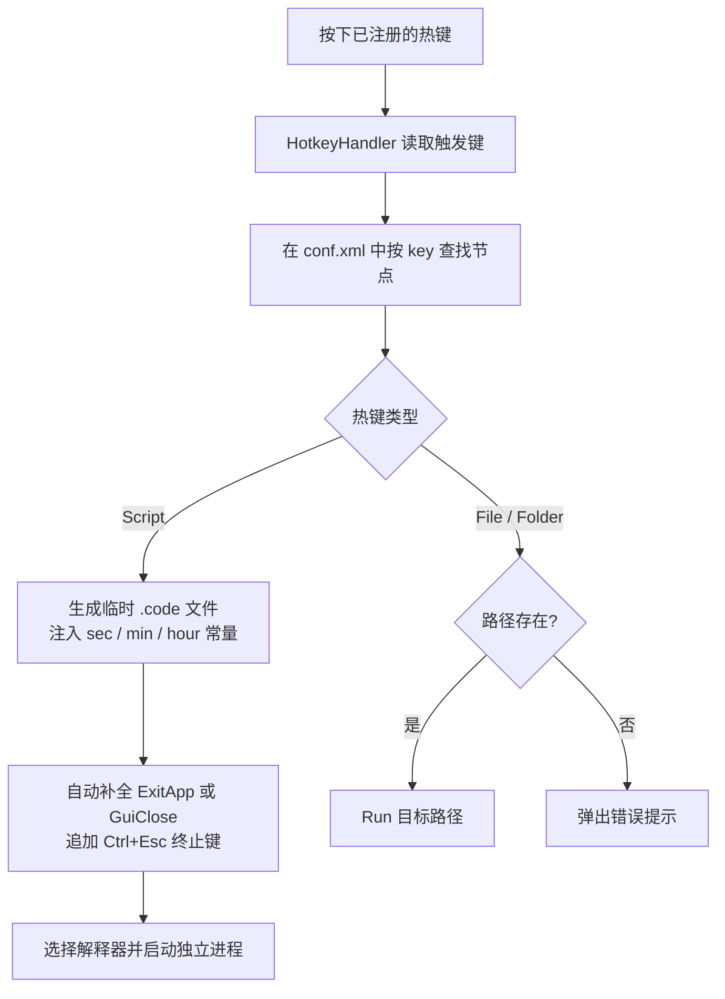
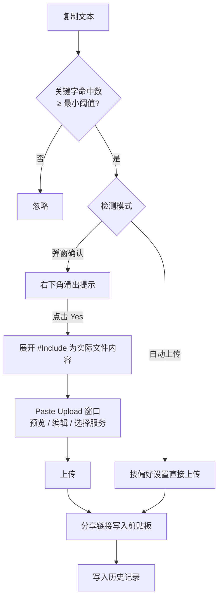
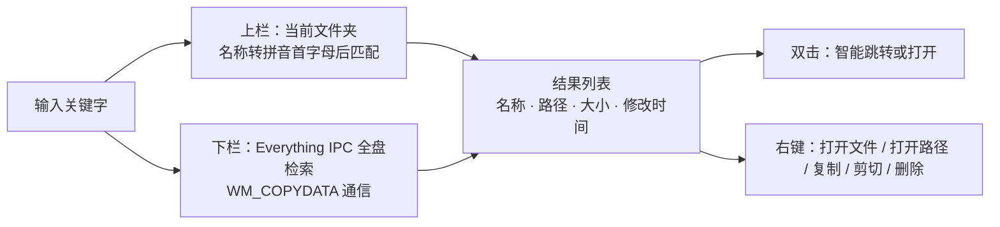
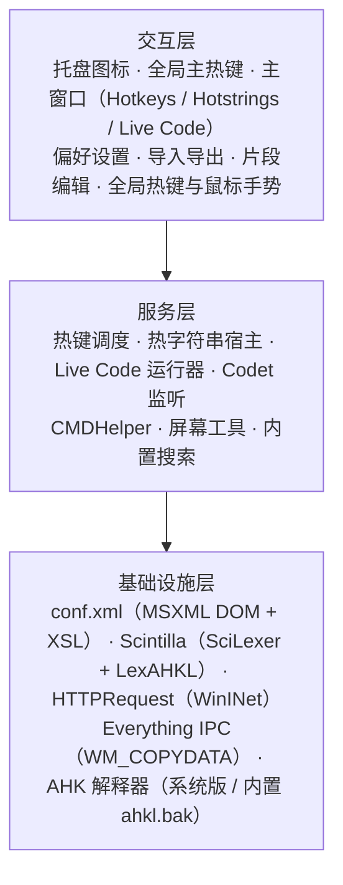

<div align="center">


# AutoHotkey ToolKit

**面向 Windows 的 AutoHotkey 一体化效率工作台**

热键与热字符串管理 · 实时代码沙盒 · 剪贴板代码分享 · 命令助手 · 屏幕工具 · 拼音即时文件检索 · 鼠标手势增强

<p>
  
  
  
  
</p>

[功能总览](#功能总览) ·
[快速开始](#快速开始) ·
[功能详解](#功能详解) ·
[快捷键速查](#快捷键速查) ·
[配置参考](#配置参考) ·
[架构设计](#架构设计) ·
[常见问题](#常见问题)

</div>

---

## 项目简介

**AHK-ToolKit** 是一个常驻系统托盘的 AutoHotkey 工具集。它把日常高频、却散落在各个脚本里的需求——全局热键、文本扩展、代码试跑、代码分享、文档速查、截图、文件检索——整合到**同一个图形界面**与**同一份配置文件**中，让 AutoHotkey 的日常使用从「反复编辑脚本并重载」升级为「所见即所得的可视化管理」。

项目由 **RaptorX** 于 2010 年创建并以 GPLv3 开源；本仓库在上游 0.8.x 的基础上继续演进至 **0.9.0-161030**。当前版本在保留全部原有能力的前提下，集成了高 DPI 自适应界面、基于 Everything 的拼音首字母即时文件检索，以及面向鼠标与滚轮的窗口管理手势层。

### 设计理念

| 理念 | 说明 |
| :-- | :-- |
| **零重启** | 热键通过 `Hotkey` 命令即时注册；热字符串由独立宿主进程承载并在变更时自动重建，新增、修改、删除均无需重启主程序。 |
| **零依赖运行** | 随程序附带 AutoHotkey_L 1.1.00.00 回退解释器（`res/ahkl.bak`）。使用编译版时，即使电脑上没有安装 AutoHotkey，Live Code 与脚本型热键依然可以运行。 |
| **配置即数据** | 全部设置、热键、热字符串、代码片段、语法配色集中保存于单个 `conf.xml`（UTF-8，缩进格式化），便于备份、迁移与版本管理。 |
| **可进可退** | 支持从现有 `.ahk` 脚本批量导入热键 / 热字符串，也可随时导出为标准 `.ahk` 文件，不被工具「锁定」。 |
| **开放可改** | 单文件主程序 + 模块化 `lib/`，代码结构清晰，GPLv3 授权，欢迎二次开发。 |

---

## 功能总览

| 模块 | 能力概述 | 入口 |
| :-- | :-- | :-- |
| **热键管理器** | 以列表管理脚本 / 文件 / 文件夹三类热键；支持左右修饰键、通配符、钩子、松开触发等高级修饰；即时生效 | 主窗口 · Hotkeys |
| **热字符串管理器** | 单行 / 多行文本扩展与脚本型热字符串；内置选项复选框；快速添加面板 | 主窗口 · Hotstrings |
| **Live Code** | 基于 Scintilla 的 AHK 实时代码沙盒：语法高亮、代码折叠、一键运行、多解释器切换 | 主窗口 · Live Code |
| **代码片段库** | 分组管理常用代码片段；双击插入、右键新建 / 编辑 / 重命名 / 删除 | Live Code 右侧面板 |
| **Codet 代码检测** | 监听剪贴板，识别 AHK 代码后弹窗确认或自动上传到 Pastebin，并回写分享链接 | 偏好设置 · Code Detection |
| **CMDHelper 命令助手** | 对光标处单词一键查询本地 CHM 帮助或在线文档；论坛 `[url]` 标签自动生成 | 全局热键 |
| **论坛 BBCode 助手** | 在 AutoHotkey 社区页面中，用热字符串快速补全 `[b]` `[code]` `[color=` `[size=` 等标签 | 浏览器 · 社区页面 |
| **屏幕工具** | 半透明选区截图、全屏截图；在设计 / 游戏类窗口中自动避让 | 全局热键 |
| **导入 / 导出** | 递归扫描文件夹或选择多个 `.ahk`，用正则解析热键与热字符串；导出为带 `#IfWinActive` 的标准脚本 | File 菜单 |
| **内置搜索** | 当前目录拼音首字母匹配 + Everything 全盘检索；智能跳转到资源管理器 / Total Commander 等 | `Alt + CapsLock` |
| **鼠标手势层** | 侧键、滚轮、右键组合：调音量与亮度、最小化 / 最大化 / 关闭窗口、窗口拖拽缩放、跨屏移动 | 鼠标 |
| **系统集成** | 托盘常驻、开机自启、单实例、挂起 / 重载热键、命令行调试参数、配置损坏恢复 | 托盘 / 命令行 |

---

## 快速开始

### 环境要求

| 项目 | 要求 |
| :-- | :-- |
| 操作系统 | Windows（内置搜索模块要求 **64 位** 系统；推荐 Windows 10 / 11） |
| 运行方式 | **预编译 EXE**（无需安装 AutoHotkey）或 **AutoHotkey_L 1.1.x 源码运行** |
| 位数 | 随附的 `SciLexer.dll`、`LexAHKL.dll` 为 32 位，主程序须以 **32 位** AutoHotkey_L 运行 / 编译 |
| 不兼容 | AutoHotkey v2.0（项目使用 v1 语法） |
| Everything | 当前版本在启动时会拉起 Everything，需自备并配置路径（见下文警告） |

> [!WARNING]
> **启动前必读：Everything 路径。** 主程序在启动阶段（`AHK-ToolKit.ahk` 约 L110–112）会无条件执行 `Gosub, EverythingStart`，先结束已运行的 `Everything64.exe` / `Everything.exe` / `LoveStudy.exe`，再从 `EveryThingPath` 启动 `LoveStudy.exe -startup`。
> 如果该路径无效，程序会提示「Everything运行出错」并**直接退出**。请先按 [需要按需修改的位置](#需要按需修改的位置) 调整路径；若不需要内置搜索，参见 [常见问题](#常见问题) 中的精简办法。

### 获取与运行

```bash
git clone https://github.com/YinsitanAI/AHK-ToolKit.git
cd AHK-ToolKit
```

**方式 A：直接运行预编译程序**

双击 `AHK-ToolKit.exe`。程序需与 `lib/`、`res/`、`conf.xml` 位于同一目录。

**方式 B：源码运行**

```bat
:: 使用 32 位 AutoHotkey_L 1.1.x 执行
AutoHotkeyU32.exe AHK-ToolKit.ahk
```

**方式 C：自行编译**

使用 Ahk2Exe 编译 `AHK-ToolKit.ahk`。源码末尾内置了 `Compile_AHK SETTINGS` 区块，已预置版本信息与图标（`res/AHK-TK.ico`）；修改过个人路径后建议重新编译。

> [!TIP]
> 仓库自带的 `conf.xml` 是作者本人的使用数据（含大量指向 `D:\` 的热键）。如果想从**干净状态**开始，请先将其重命名或删除，程序将自动进入下方的首次运行向导并生成默认配置。

### 首次运行向导

当 `conf.xml` 不存在时，程序弹出 **First Run** 窗口，一次性完成基础设置：

| 分组 | 选项 |
| :-- | :-- |
| Startup | 显示启动画面 · 随 Windows 启动 · 启动后最小化 · 启动时检查更新 |
| Main GUI Hotkey | 唤出主窗口的全局热键，默认 `` Win + ` ``（Win + 反引号） |
| Other Tools | 启用代码检测 · 启用命令助手 · 启用论坛标签自动补全 · 启用屏幕工具 |

所有选项之后均可在 **Settings → Preferences**（`Ctrl + P`）中修改。

### 日常使用路径

1. 按 `` Win + ` `` 呼出主窗口（再按一次隐藏；点击托盘图标同样可以切换）。
2. 在 **Hotkeys** 页点击 **Add**，选择类型、录入按键，保存后**立即生效**。
3. 在 **Hotstrings** 页的 **Quick Add** 区填入缩写与展开内容，点 **Add** 即可使用。
4. 在 **Live Code** 页写下脚本，点 **Run** 试跑；常用代码存入片段库。

---

## 功能详解

### 热键管理器

在 **Hotkeys** 页以表格集中管理所有热键，列为 **类型 / 名称 / 热键 / 路径或脚本预览**，热键以 `Win + W`、`Ctrl + Alt + S` 的易读格式展示（内部以 AHK 短格式 `#w`、`^!s` 存储，由 `hkSwap` 双向转换）。

**三种热键类型**

| 类型 | 行为 |
| :-- | :-- |
| **Script** | 在内置 Scintilla 编辑器中直接编写脚本；触发时在独立进程中运行 |
| **File** | 启动 `.exe` / `.ahk` 等文件；触发时先检查文件是否存在，缺失则给出提示 |
| **Folder** | 在资源管理器中打开指定文件夹 |

**高级修饰（Add Hotkey 对话框）**

| 选项 | 对应前缀 | 作用 |
| :-- | :--: | :-- |
| Left mod / Right mod | `<` / `>` | 仅响应左 / 右侧修饰键 |
| Wildcard | `*` | 即使同时按下其他修饰键也触发 |
| Send key to active window | `~` | 触发的同时保留按键原有功能 |
| Install hook | `$` | 强制使用键盘钩子 |
| Fire when releasing key | ` UP` | 松开按键时才触发 |

**脚本型热键的执行机制**



- 脚本模板自带 `#NoEnv`、`#SingleInstance Force`、`SetBatchLines -1`、`SendMode Input`，并预置 `sec` / `min` / `hour` 三个时间常量，方便写 `Sleep 5*sec` 这类语句。
- 脚本中不含 `Gui` 时自动追加 `ExitApp`；含 `Gui` 但缺少 `GuiClose` 时自动补齐退出标签，避免遗留僵尸进程。
- 每个临时脚本均附带全局终止键 **`Ctrl + Esc`**。

**日常操作**

- **双击**条目进入编辑；**双击空白处**新建；**Delete** 键删除，支持多选。
- 底部 **Quick Search** 同时检索名称与路径，输入即过滤。
- 状态栏实时显示当前生效的热键与热字符串数量、程序版本。
- 「窗口激活 / 非激活」条件字段（逗号分隔，支持正则）会随条目保存，并在**导出**为 `.ahk` 时转换为 `#IfWinActive` / `#IfWinNotActive`；运行期的条件过滤仍在路线图中（见[已知限制与路线图](#已知限制与路线图)）。

### 热字符串管理器

**Hotstrings** 页提供两种录入方式：

- **Quick Add**：填写缩写（Expand）与展开内容（To），并通过复选框组合选项。
- **Add Hotstring 对话框**：内置多行 Scintilla 编辑器，适合长文本与代码块。

| 复选框 | 对应选项 | 说明 |
| :-- | :--: | :-- |
| AutoExpand | `*` | 输入缩写后立即展开，无需终止符 |
| Do not delete typed abbreviation | `B0` | 展开时保留已输入的缩写 |
| Trigger inside other words | `?` | 允许在单词内部触发 |
| Send Raw | `R` | 原样发送，不翻译 `{Enter}`、`{key}` |
| Run as Script | — | 展开内容作为 AHK 代码执行，而非文本 |

**工作原理：** 热字符串并不在主进程中注册，而是由程序在 `%TEMP%\hslauncher.code` 中生成一份热字符串脚本，交给宿主进程（系统 AutoHotkey 或内置 `res/ahkl.bak`）运行。每次新增 / 修改 / 删除都会终止旧宿主并重建，因此**全程不用重启主程序**。宿主内置 `Alt + F11` 用于临时挂起全部热字符串。

### Live Code 实时代码沙盒

无需新建文件，直接在 **Live Code** 页编写并运行 AutoHotkey 脚本，适合验证一条语句、调试 GUI 布局，或在没有 AHK 环境的电脑上临时跑脚本。

**编辑器能力**

- 基于 **Scintilla**，使用专用 AHK_L 词法分析器（`LexAHKL.dll`）。
- **语法高亮**覆盖注释（行 / 块 / 文档）、字符串、标签、热键 / 热字符串、数字、变量、对象、用户函数、指令、命令、参数、流程控制、内置函数 / 变量、按键名、转义序列与错误。
- 7 组关键字（指令 / 命令 / 参数 / 流程控制 / 函数 / 内置变量 / 按键）读取自 `conf.xml`，可自行增删；各语法元素的配色目前由源码中的 `SetSciStyles()` 统一定义。
- 带行号页边与**代码折叠**，支持自动换行与窗口置顶。
- **File** 菜单提供 Open / Save / Save As（UTF-8），打开时记忆上次目录。

**运行引擎（Settings → Run Code With）**

| 引擎 | 用途 |
| :-- | :-- |
| L-Ansi / L-Unicode | 指向本机 AutoHotkey_L 的 ANSI / Unicode 可执行文件 |
| Basic | 经典 AutoHotkey |
| IronAHK | IronAHK 解释器 |

只有在 `conf.xml` 的 `RCPaths` 中配置了路径的引擎才会在菜单中可选；当前所选引擎的路径为空时，自动回退到内置的 `res/ahkl.bak`，保证开箱即用。点击 **Run** 或使用脚本型热键时，程序会生成带统一前导（含 `sec` / `min` / `hour` 常量）的临时文件并交由所选引擎运行。

**代码片段库（Snippet Library）**

- 以**分组**组织；工具栏下拉框切换分组，右键菜单提供 **New / Edit / Rename / Delete**。
- **双击**条目即把片段插入编辑器光标处；`F2` 内联重命名，`Delete` 删除。
- 默认内置 6 个实用示例：Coord Saver（坐标记录）、Schedule Shutdown（定时关机）、Text Control – Style Ref.（文本控件样式对照）、Version Test（解释器版本检测）、Get Control Name / Get Control Hwnd（控件名称与句柄探测）。
- 可通过 **View → Snippet Library** 显示或隐藏整个面板。

### Codet：剪贴板代码检测与一键分享

Codet 监听系统剪贴板，当复制的文本**命中足够多的 AHK 关键字**时，判定为 AutoHotkey 代码并引导你分享。



| 能力 | 说明 |
| :-- | :-- |
| 可调检测灵敏度 | 关键字列表可增删，**最小命中数**默认 5，兼顾准确率与误报 |
| 两种模式 | **Show Popup**：从屏幕右下角滑出确认框（数秒后自动收起，可在框内直接关闭弹窗模式）；**Automatic Upload**：命中即按偏好设置上传并播放提示音 |
| 展开 `#Include` | 通过弹窗确认上传时，自动把 `#Include` 行替换为被包含文件的实际内容，避免「忘了说还有 include」 |
| 多服务支持 | AutoHotkey.net（支持昵称与隐私设置，公开时自动在 IRC 频道播报）；Pastebin.com（用户 Key、公开 / 私有、过期时间：永久 / 10 分钟 / 1 小时 / 1 天 / 1 个月） |
| Paste Upload 窗口 | 带语法高亮的预览编辑器，可在上传前修改，亦可 **Save to File** 存为 `.ahk` |
| 历史记录 | 保存最近若干条（默认 10 条）上传的时间、链接与前 4 行预览 |

> [!CAUTION]
> **Automatic Upload 不经二次确认。** 任何命中阈值的剪贴板内容都会被上传到第三方服务。涉及私有代码、凭据或内部信息时，请使用 **Show Popup** 模式或关闭 Codet。另外，`conf.xml` 以明文保存 Pastebin 用户 Key 等字段，请勿将含有真实凭据的配置文件公开提交。

### CMDHelper：命令助手与论坛标签

在任意文本编辑器里，把光标放在命令名上即可速查，无需切换窗口手动检索。

| 功能 | 默认热键 | 行为 |
| :-- | :--: | :-- |
| **Open Help File** | `Ctrl + F1` | 自动选中光标处单词，调用 `hhctrl.ocx` 在本地 `AutoHotkey.chm` 中做关键字定位；失败时打开 CHM 并自动检索 |
| **Forum Tags** | `Ctrl + F2` | 识别该单词属于变量 / 函数 / 命令，生成官方在线文档链接；在「AutoHotkey Community」窗口中直接输入 `[url=…]单词[/url]`，其他窗口则在浏览器中打开 |

- 链接匹配先在对应文档页检索，失败后退化为站内搜索，并给出「结果可能不准确」的提示。
- **Preferences → Command Helper** 提供总开关、**Use Online Help**（对应 `HelpPath@online`）、论坛标签开关，以及两个热键与 CHM 路径的设置。
- 默认热键为 `Ctrl + F1` / `Ctrl + F2`，可改为任意修饰键与按键组合。

### 论坛 BBCode 助手

在窗口标题包含「AutoHotkey Community」的页面中，自动启用一组热字符串：

- 成对标签自动补全并把光标停在中间：`[b]` `[i]` `[u]` `[s]` `[c]` `[list]` `[code]` `[quote]` `[youtube]` `[gist]` `[img]` `[url]`；
- `[url=` 自动粘贴剪贴板内容作为链接地址；
- `[color=` 弹出颜色菜单（14 种预设色 + 自定义十六进制色值）；
- `[size=` 弹出字号菜单（Tiny / Small / Normal / Large / Huge / 自定义）。

### 屏幕工具

| 操作 | 说明 |
| :-- | :-- |
| `Shift + Alt + 左键拖拽` | 拖出半透明选区，实时显示宽高；**松开左键**即截取该区域，保存为 PNG；拖动期间按右键可取消 |
| `Print Screen` | 全屏截图（需在偏好设置中启用） |

- 截图引擎来自 `lib/sc.ahk`，底层支持整个桌面 / 活动窗口 / 客户区 / 当前显示器 / 任意矩形、可选包含鼠标指针、可缩放，并输出 BMP / JPG / PNG / GIF / TIF 或写入剪贴板。
- **自动避让**：当活动窗口属于 Photoshop、Illustrator、3ds Max、After Effects 等设计软件，或特定游戏窗口时，选区热键自动让出，避免冲突。
- 偏好设置中的两项开关分别控制「选区截图」与「Print Screen 截图」。

> [!NOTE]
> 当前源码中的上传环节（Imgur 接口）处于注释状态，且 `Print Screen` 处理段保留了作者本机的目标目录（`FileMove`）。使用前请参考 [需要按需修改的位置](#需要按需修改的位置) 调整。

### 导入与导出

**导入（File → Import/Export → Import）**

- 来源可选**文件夹**（可勾选递归子文件夹）或**多个文件**；可分别选择导入热键 / 热字符串。
- 基于正则解析，能识别带修饰前缀的热键、带选项的热字符串，以及**单行**与**多行**两种写法。
- 解析结果先在预览列表中呈现：**双击**条目会用记事本打开来源文件并尝试定位到该条目，`Delete` 可剔除不想导入的条目；确认后点 **Accept** 才会写入配置。

**导出**

- 将热键与热字符串导出为标准 `.ahk` 文件，目标文件已存在时可选择**追加**。
- 若条目设置了窗口条件，导出时自动包裹 `#IfWinActive` / `#IfWinNotActive`。

### 内置搜索

基于 Everything 与拼音首字母的即时文件检索。按 **`Alt + CapsLock`** 呼出无边框搜索窗口，边输入边出结果。



| 特性 | 说明 |
| :-- | :-- |
| **上下双栏** | 上栏检索「触发搜索时所在窗口」的当前目录，下栏展示 Everything 全盘结果（最多 200 条，自动去重） |
| **拼音首字母** | 上栏检索时，`zh2py` 依据 GB2312 一、二级汉字区位码把文件名转为拼音首字母串再匹配，例如输入 `wd` 即可命中「文档」；模块另附 Unicode→拼音码表用于生僻字与多音字补全（当前加载语句处于注释状态，可按需启用） |
| **当前路径感知** | 自动识别资源管理器、Total Commander、7-Zip、FileZilla、FreeCommander、通用文件对话框、控制台、桌面等窗口的当前路径 |
| **智能跳转** | 双击结果时，若来源窗口是受支持的文件管理器或文件对话框，则直接**在原窗口内跳转**到目标路径；否则以默认方式打开 |
| **右键菜单** | 打开文件 · 打开路径 · 复制 · 剪切 · 删除（进回收站）；复制 / 剪切使用真实的 `CF_HDROP` 文件剪贴板，可直接在资源管理器中粘贴 |
| **视图切换** | **切换** 按钮在详细信息视图与图标视图间切换 |
| **索引重建** | **重建** 按钮让 Everything 重新建立索引，状态栏显示耗时 |
| **便捷细节** | 单击状态栏复制所选条目路径；窗口失去焦点自动关闭；多显示器下就近弹出 |

> [!NOTE]
> 内置搜索依赖外部的 Everything（`Everything32.dll` + 主程序，当前以 `LoveStudy.exe` 命名）。仓库**不包含**这些文件，需自行下载并在源码中配置路径。下栏的全盘拼音检索取决于 Everything 一侧的拼音能力；模块内附带 VC++ 运行库检测与静默安装函数（默认注释）。

### 鼠标手势与窗口管理层

> [!IMPORTANT]
> 这一层是**作者的个人工作流**，位于 `AHK-ToolKit.ahk` 的 `[Hotkeys/Hotstrings]` 区段，其中不少动作会调用本机的外部脚本（路径硬编码为 `D:\...`）。启用前请通读该区段，保留需要的、删除或改写不需要的。

**侧键与滚轮**

| 组合 | 动作 |
| :-- | :-- |
| `XButton1`（侧键 1）按住 + 滚轮 | 调节系统音量（`SoundSet ±1`） |
| `XButton1` + 左键 | 运行外部脚本（作者用于播放列表） |
| `XButton1` 短按 | 鼠标位于窗口顶部标题栏区域时，把窗口发送到左 / 右侧显示器（`Shift + Win + ←/→`，按位置在窗口左半或右半决定方向）；其他位置则唤起外部菜单脚本 |
| `XButton2`（侧键 2）按住 + 滚轮 | 调节屏幕背光亮度：通过 `DeviceIoControl` 访问 `\\.\LCD` 的亮度 IOCTL，必要时自动启动 NVIDIA 显示容器服务 |
| `XButton2` 短按 | 呼出任务切换脚本；亮度调节结束后自动停止所需服务 |
| 滚轮左倾（单次） | 最小化鼠标下窗口；在桌面上则呼出任务切换脚本 |
| 滚轮左倾（连续两次） | 最大化 ⇄ 还原；在桌面上恢复上一个被最小化的窗口；远程桌面窗口走专用脚本 |
| 滚轮左倾（连续快速触发） | 关闭鼠标下窗口 |

**右键窗口操控（类 KDE 风格）**

| 组合 | 动作 |
| :-- | :-- |
| `右键` + 滚轮下 | 窗口已最大化则还原并**跟随鼠标移动**；否则最小化 |
| `右键` + 滚轮上 | 最小化窗口还原并跟随鼠标；普通窗口则最大化 |
| `右键` + 中键 | 按光标所在象限**拖拽缩放**窗口 |
| `右键` + 左键 | 最小化鼠标下的窗口 |
| 松开右键 | 在上述手势后自动补发 `Esc`，抑制多余的右键菜单 |
| `左键` + 右键 | 启动 / 退出外部翻译工具 |

**键盘增强**

| 组合 | 动作 |
| :-- | :-- |
| `Shift + 字母` / `Shift + CapsLock` | 通过 `RunNoToggle` 启动预设目标。它会先注入未分配的虚拟键 `vk07`，使输入法不再把「单击 Shift」识别为中英文切换 |
| 双击 `Alt` | 运行自动输入法切换脚本 |
| `` Ctrl + ` `` | 运行外部翻译脚本 |
| `Alt + CapsLock` | 呼出[内置搜索](#内置搜索) |

### 系统集成与可靠性

- **托盘常驻**：单击托盘图标显示 / 隐藏主窗口，悬浮提示显示版本与 ANSI / Unicode 版本。
- **开机自启**：写入 `HKCU\Software\Microsoft\Windows\CurrentVersion\Run`，可在偏好设置中随时开关。
- **挂起与重载**：`Ctrl + F12` 挂起 / 恢复全部热键；`Ctrl + Break` 重载脚本。
- **单实例**：`#SingleInstance Force`，重复启动会替换旧实例。
- **高 DPI 自适应**：对话框与 Scintilla 控件按 `A_ScreenDPI / 96` 缩放；主窗口使用 `Attach` 实现控件随窗口自适应伸缩。
- **配置容错**：`conf.xml` 损坏时给出清晰提示，可选择恢复默认配置（会丢失个人数据）或中止并手动修复；版本号变更时自动同步配置。
- **自动清理**：退出时清除 `%TEMP%` 下的内置解释器副本与临时 `.code` 文件，并结束热字符串宿主进程；启动时对工作集做内存精简。
- **版本检查与更新**：支持联网检查更新、下载压缩包、覆盖安装并重启（见下方说明）。
- **UX 细节**：输入框内置灰色斜体占位提示（如 `e.g. btw`、`Quick Search`），聚焦时自动清除。

> [!WARNING]
> 自动更新的地址指向**上游** `RaptorX/AHK-ToolKit`。本分支默认关闭「启动时检查更新」（`cfu="0"`），请保持关闭，以免被上游版本覆盖本地改动。

---

## 快捷键速查

### 全局

| 快捷键 | 功能 |
| :-- | :-- |
| `` Win + ` `` | 显示 / 隐藏主窗口（可在偏好设置中更换） |
| `Ctrl + F12` | 挂起 / 恢复所有热键 |
| `Ctrl + Break` | 重载脚本 |
| `Ctrl + F1` | CMDHelper：查询光标处单词的帮助（默认值，可自定义） |
| `Ctrl + F2` | CMDHelper：生成论坛 `[url]` 标签 / 打开在线文档（默认值，可自定义） |
| `Alt + CapsLock` | 内置搜索 |
| `Shift + Alt + 左键拖拽` | 区域截图（需启用） |
| `Print Screen` | 全屏截图（需启用） |
| `Alt + F11` | 挂起 / 恢复热字符串宿主进程 |
| `Ctrl + Esc` | 终止由 Live Code / 脚本型热键启动的临时脚本 |

### 主窗口内

| 快捷键 | 功能 |
| :-- | :-- |
| `Ctrl + N` | 按当前页新建热键 / 热字符串 / 代码片段 |
| `Ctrl + O` / `Ctrl + S` / `Ctrl + Shift + S` | 打开 / 保存 / 另存为（Live Code 页） |
| `Ctrl + I` | 导入热键 / 热字符串 |
| `Ctrl + P` | 偏好设置 |
| `Delete` | 删除选中条目 |
| `F2` | 重命名选中的代码片段 |
| `Esc` | 关闭当前对话框 / 隐藏主窗口 |

### 偏好设置：关键字检索

| 快捷键 | 功能 |
| :-- | :-- |
| `F3` | 在 Codet 关键字列表中查找下一个 |
| `Delete` | 清除当前检索并复位 |

---

## 配置参考

全部数据保存在程序目录下的 **`conf.xml`**，结构如下（节选）：

```xml
<AHK-Toolkit version="0.9.0-161030" alwaysontop="0">
  <Options>
    <Startup ssi="0" sww="1" smm="1" cfu="0"/>          <!-- 启动选项 -->
    <MainKey ctrl="0" alt="0" shift="0" win="1">`</MainKey>
    <SuspWndList/>
    <Codet status="0" mode="1">                         <!-- 代码检测 -->
      <Pastebin current="AutoHotkey.net">…</Pastebin>
      <History max="10"/>
      <Keywords min="5">…</Keywords>
    </Codet>
    <CMDHelper global="1" sci="1" forum="1" tags="1">   <!-- 命令助手 -->
      <HelpKey ctrl="1" alt="0" shift="0" win="0">F1</HelpKey>
      <TagsKey ctrl="1" alt="0" shift="0" win="0">F2</TagsKey>
      <HelpPath online="0">…\AutoHotkey.chm</HelpPath>
    </CMDHelper>
    <LiveCode linewrap="1" highlighting="1" snplib="1"> <!-- 代码沙盒 -->
      <RCPaths current="L-Unicode">…</RCPaths>
      <SnippetLib current="Example Snippets">…</SnippetLib>
      <Keywords>…</Keywords>
      <Styles>…</Styles>                                <!-- 预留，当前配色见源码 -->
    </LiveCode>
    <ScrTools altdrag="0" prtscr="0">…</ScrTools>       <!-- 屏幕工具 -->
  </Options>
  <Hotkeys count="…">
    <hk type="Script|File|Folder" key="#W">
      <name/> <path/> <script/> <ifwinactive/> <ifwinnotactive/>
    </hk>
  </Hotkeys>
  <Hotstrings count="…">
    <hs iscode="0" opts="*">
      <expand/> <expandto/> <ifwinactive/> <ifwinnotactive/>
    </hs>
  </Hotstrings>
</AHK-Toolkit>
```

| 节点 / 属性 | 含义 |
| :-- | :-- |
| `Startup@ssi / sww / smm / cfu` | 启动画面 / 随 Windows 启动 / 启动后最小化 / 启动检查更新 |
| `MainKey` | 主窗口全局热键（修饰键为属性，按键为节点文本） |
| `Codet@status / mode` | 是否启用检测；`1` 弹窗确认，`2` 自动上传 |
| `Codet/Keywords@min` | 判定为 AHK 代码所需的最小关键字命中数 |
| `CMDHelper@global / sci / forum / tags` | 命令助手总开关 / 内置编辑器 / 论坛辅助 / 标签自动补全 |
| `HelpPath@online` | `1` 使用在线文档，`0` 使用本地 CHM |
| `LiveCode@linewrap / snplib` | 自动换行 / 是否显示片段库面板 |
| `RCPaths@current` | 当前运行引擎：`L-Ansi` · `L-Unicode` · `Basic` · `IronAHK` |
| `ScrTools@altdrag / prtscr` | 选区截图 / Print Screen 截图开关 |
| `hk@type` / `hk@key` | 热键类型；按键（含 `$ ~ * < > ^ ! + #` 前缀与 ` UP` 后缀） |
| `hs@iscode` / `hs@opts` | 是否为脚本型；热字符串选项 |

### 需要按需修改的位置

这是一份**个人化配置清单**。克隆后请先逐项核对，再投入日常使用：

| 位置 | 内容 | 建议 |
| :-- | :-- | :-- |
| `AHK-ToolKit.ahk` L110–111 | `EveryThingPath`、`EveryThingDll`（Everything 目录与 `Everything32.dll`） | 改为本机实际路径，否则启动即退出 |
| `lib/FileSearch.ahk` L39–46、L974 | 「库\文档 / 图片 / 音乐 / 视频」回退目录写死为 `C:\Users\Administrator\…` | 改用 `A_MyDocuments` 等系统变量或你的用户目录 |
| `AHK-ToolKit.ahk` `[Hotkeys/Hotstrings]` 区段 | `Shift + 字母` 启动器、鼠标手势所调用的外部脚本与 `.ini` | 替换为自己的目标，或删除不需要的段落 |
| `AHK-ToolKit.ahk` `PrintScreen::` 段 | `FileMove` 的目标目录 | 改成自己的保存位置，或启用上传逻辑 |
| `conf.xml` `HelpPath` / `RCPaths` | AutoHotkey 帮助文件与各解释器路径 | 指向本机路径；留空则回退内置解释器 |
| `conf.xml` `Hotkeys` | 作者个人的热键数据 | 删除 `conf.xml` 以重新生成 |

### 命令行参数

| 参数 | 说明 |
| :-- | :-- |
| `-h` · `--help` | 显示参数帮助 |
| `-v` · `--version` | 显示作者与版本信息 |
| `-d` · `--debug` | 开启调试，信息输出到 `OutputDebug` |
| `-sd <file.txt>` · `--save-debug <file.txt>` | 开启调试并写入指定文本文件 |
| `-src` · `--source-code` | 把内嵌的源码导出到指定位置（便于查看编译版的源码） |

---

## 架构设计



### 技术要点

| 主题 | 实现 |
| :-- | :-- |
| 配置存储 | `MSXML2.DOMDocument` 读写 XML，写回前以 XSL 样式表（`indent="yes"`）整体格式化，保持文件可读；多处操作前重新载入以保证数据一致 |
| 编辑器 | Scintilla 5 个实例（Live Code、热键脚本、热字符串、代码片段、Paste Upload），共用同一套样式与折叠页边初始化逻辑 |
| 窗口布局 | 以 GUI 编号区分窗口与面板：主窗口、新增热键 / 热字符串、导入、导出、偏好设置及其 7 个子面板、新增片段、关于、Paste Upload、Codet 弹窗、选区遮罩与启动画面；`Attach` 库负责缩放自适应 |
| 进程模型 | 主进程负责 GUI 与调度；脚本型热键、Live Code、热字符串均以**独立子进程**运行，互不影响，崩溃不会拖垮主程序 |
| 网络 | 基于 WinINet 的 `HTTPRequest` 完成 Pastebin 上传、在线文档检索与更新检查 |
| 外部通信 | 通过 `WM_COPYDATA` 与 Everything 的 IPC 窗口交换查询请求与结果 |
| 输入法 | 提供 IME 状态读写工具函数（`IME_GET` / `IME_SET` 等）与 `vk07` 空键注入技巧 |

### 目录结构

```text
AHK-ToolKit/
├── AHK-ToolKit.ahk        主程序（约 5,600 行）：GUI、热键 / 热字符串、Live Code、Codet、CMDHelper、屏幕工具、手势层
├── AHK-ToolKit.exe        预编译程序
├── conf.xml               配置与数据存储
├── Changelog.txt          上游版本变更记录
├── lib/
│   ├── FileSearch.ahk     内置搜索：Everything 封装、拼音首字母、智能路径跳转、IME 工具（含 Unicode→拼音表）
│   ├── sci.ahk            Scintilla 的 AHK 封装
│   ├── SciLexer.dll       Scintilla 控件（32 位）
│   ├── LexAHKL.dll        AHK_L 词法分析器（32 位）
│   ├── scriptobj.ahk      脚本对象：命令行参数、更新、启动画面、自启动、调试
│   ├── sc.ahk             屏幕捕获与图片格式转换
│   ├── httprequest.ahk    HTTP 请求库
│   ├── attach.ahk         控件随窗口自适应伸缩
│   ├── klist.ahk          按键名列表生成器
│   ├── hkswap.ahk         热键长 / 短格式互转
│   ├── uriswap.ahk        URI 编码 / 解码
│   ├── htmlhelp.ahk       CHM 关键字定位与论坛链接生成
│   ├── hash.ahk           MD5 / SHA1 哈希
│   └── talk.ahk           脚本间通信
├── res/
│   ├── ahkl.bak           内置回退解释器（AutoHotkey_L 1.1.00.00）
│   ├── AHK-TK.ico         程序图标
│   └── img/               启动画面、关于页图片等
└── resources/             位图与图标资源
```

### 第三方组件

| 组件 | 来源 / 作者 | 用途 |
| :-- | :-- | :-- |
| Scintilla（`SciLexer.dll`） | Neil Hodgson 等 | 代码编辑控件 |
| `LexAHKL.dll` | AHK_L 社区 | AHK 语法高亮词法分析 |
| AutoHotkey_L（`res/ahkl.bak`） | AutoHotkey 社区 | 内置回退解释器，遵循其自身许可证 |
| `Attach` | majkinetor | 控件自适应缩放 |
| `HTTPRequest` v2.41 | [VxE] | HTTP 通信 |
| `AutoXYWH` | tmplinshi / toralf | 控件缩放辅助 |
| `RunAsTask` | SKAN | 以计划任务实现免 UAC 提权（已定义，当前未被调用） |
| `Hash` | Lazlo | MD5 / SHA1（已引入，当前未被调用） |
| `talk` | Avi Aryan（MIT） | 脚本间通信（随附，当前未被 `#include`） |
| Everything SDK / IPC | voidtools | 全盘文件检索（外部依赖，不随仓库分发） |

---

## 已知限制与路线图

| 状态 | 事项 |
| :--: | :-- |
| 待完善 | 热键 / 热字符串的 `#IfWinActive` 条件：目前**保存并支持导出**，运行期过滤尚未实现 |
| 待完善 | Live Code 的「选中代码一键运行」（`Ctrl + F5`）：热键段已注释，`lcRun()` 接口保留，取消注释即可恢复 |
| 待完善 | Edit / Search 菜单、Show Symbols、Zoom、Help / Documentation、Context Menu Options 等菜单项目前处于禁用状态 |
| 待完善 | 偏好设置中 Live Code 的 *Run Code With / Keywords / Syntax Styles* 面板为占位页（显示 Under Construction），相关配置请直接编辑 `conf.xml` |
| 待完善 | 「Suspend hotkeys on these windows」「Enable in Internal Editors」选项在界面中禁用 |
| 待完善 | DPaste / Gist 已在配置结构中预留，界面尚未开放 |
| 待完善 | 屏幕截图的在线上传（Imgur）当前注释；`Print Screen` 段含本机硬编码目录 |
| 注意 | Autoexec 中的自动提权代码引用了未定义的 `ShellExecute` 变量，实际不会触发 UAC；需要管理员权限时请手动「以管理员身份运行」，或改用 `lib/FileSearch.ahk` 中的 `RunAsTask()` |
| 注意 | AutoHotkey.net、ImageShack、Imgur v2 等为 2012 年前后的第三方接口，可用性取决于服务方现状，可能已失效 |
| 注意 | 仓库中的 `AHK-ToolKit.exe` 为预编译产物，无法保证与最新源码逐行一致；修改源码后请重新编译 |

上游 Changelog 中尚未完成的计划项：为热键 / 热字符串增加窗口条件功能、修复导出时追加到已有文件的问题、修复 Live Code 对空文件名的保存、选中「Disabled」选项时隐藏子列表、按需下载 AHK_L 回退解释器。

---

## 常见问题

<details>
<summary><b>启动后立即退出，提示「Everything运行出错」</b></summary>

主程序启动时会拉起 `EveryThingPath` 下的 `LoveStudy.exe`。请确认 `AHK-ToolKit.ahk` L110–111 的路径指向真实存在的 Everything 目录，并且目录中有可执行文件与 `Everything32.dll`（可将 `Everything.exe` 重命名为 `LoveStudy.exe`，或同步修改源码中的文件名）。

**不需要内置搜索？** 需要同步精简以下几处（未经实机验证，修改前请备份）：

1. 删除自动执行段中的 `Gosub, EverythingStart`；
2. 删除 `Exit:` 标签中的 `Gosub,EverythingStop`；
3. 删除文件末尾的 `#include <FileSearch>` 与 `!CapsLock::Gosub, FileSearchKey` 热键。

</details>

<details>
<summary><b>提示「AutoHotkey 版本不兼容」</b></summary>

源码运行需要 AutoHotkey_L **1.1 及以上**（v1 语法），并且不兼容 v2。可改用预编译的 `AHK-ToolKit.exe`。
</details>

<details>
<summary><b>热键在以管理员身份运行的窗口中不生效</b></summary>

Windows 的 UIPI 机制不允许普通权限进程向高权限窗口发送输入。请以管理员身份运行 AHK-ToolKit（右键 → 以管理员身份运行），或改用 `RunAsTask()` 注册免 UAC 提示的计划任务。
</details>

<details>
<summary><b>热字符串不生效</b></summary>

热字符串由 `%TEMP%\hslauncher.code` 对应的宿主进程提供。请检查：宿主是否被 `Alt + F11` 挂起；`%TEMP%` 下该文件是否存在；`Ctrl + F12` 是否处于全局挂起状态。
</details>

<details>
<summary><b>如何备份、迁移或重置配置</b></summary>

- **备份 / 迁移**：复制 `conf.xml` 即可；也可通过 **File → Import/Export → Export** 导出为 `.ahk`。
- **重置**：删除（或重命名）`conf.xml` 后重启，进入首次运行向导。
- **配置损坏**：程序会提示并允许恢复为默认配置，但这将丢失已保存的热键与热字符串，建议平时定期备份。
</details>

<details>
<summary><b>Live Code 提示找不到解释器 / 想换用其他 AutoHotkey 版本</b></summary>

在 `conf.xml` 的 `RCPaths` 中填写目标 `AutoHotkey.exe` 路径，随后在 **Settings → Run Code With** 中选择对应引擎。路径留空时会使用内置回退解释器。
</details>

<details>
<summary><b>`Shift` 组合键与输入法冲突</b></summary>

手势层的 `Shift + 字母` 启动器通过 `RunNoToggle` 在触发前注入未分配的虚拟键 `vk07`，让输入法不再把这次 `Shift` 当作「单击」而切换中英文。若你使用的输入法行为不同，可调整该函数。
</details>

---

## 版本演进

> 版本号规则（源自 `Changelog.txt`）：`主版本.功能.变更.缺陷`。

| 版本 | 日期 | 主要变化 |
| :-- | :-- | :-- |
| **0.9.0-161030** | 本仓库 | 新增高 DPI 自适应界面；新增 Everything 拼音首字母内置搜索；新增鼠标 / 滚轮窗口管理手势层与 `Shift` 启动器；修复为单个按键设置热键时 `~` 前缀导致配置无法匹配的问题 |
| 0.8.1.1 | 2012-10-05 | Scintilla 控件语法高亮；修复调试三元表达式、`getparams()`、状态栏居中、编译版 `update()`；更新函数并入 `scriptobj` |
| 0.8 | 2012-09-29 | 新增语法高亮；更新默认关键字、Scintilla 封装与 `SciLexer.dll` |
| 0.7.7.7 | 2012-09-21 | 新增临时挂起全部热键；Live Code 记忆上次目录；启动前检查 AHK 版本与文件存在性；运行选中代码改为 `Ctrl + F5` |
| 0.7.6.6 | 2012-07-13 | 新增屏幕工具偏好设置；启动前检测是否安装 AutoHotkey；修复检查更新期间界面不显示 |
| 0.7.5.5 | 2012-05-27 | 更新 README；修复关于窗口版本号显示 |

> 0.9.0-161030 一行由源码分析归纳得出；上游完整记录见 [`Changelog.txt`](Changelog.txt)。

---

## 参与贡献

欢迎通过 Issue 与 Pull Request 参与改进。提交前建议：

1. 在 Windows 上使用 32 位 AutoHotkey_L 1.1.x 实际运行验证；
2. 不要提交含个人路径、账号、Key 的 `conf.xml`；
3. 个人化的手势 / 启动器改动请与通用功能分开提交，便于评审与合并。

## 许可证

本项目遵循 **GNU General Public License v3.0（GPLv3）**。

```text
Copyright © 2010–2012 RaptorX <GPLv3>

This program is free software: you can redistribute it and/or modify it under the
terms of the GNU General Public License as published by the Free Software Foundation,
either version 3 of the License, or (at your option) any later version.

This program is distributed in the hope that it will be useful, but WITHOUT ANY
WARRANTY; without even the implied warranty of MERCHANTABILITY or FITNESS FOR A
PARTICULAR PURPOSE. See the GNU General Public License for more details.
```

完整许可文本：<https://www.gnu.org/licenses/gpl-3.0.txt>。第三方组件遵循各自的许可协议，详见上文「第三方组件」。

## 致谢

- **RaptorX** —— AHK-ToolKit 的原作者与上游维护者（[上游讨论帖](http://www.autohotkey.com/forum/topic61379.html#376087)）；
- AutoHotkey 与 AutoHotkey_L 社区；
- Scintilla、Everything 以及 `lib/` 中各开源库的作者。

<div align="center">

<sub>AutoHotkey ToolKit · 让每一次按键都更有价值</sub>

</div>
